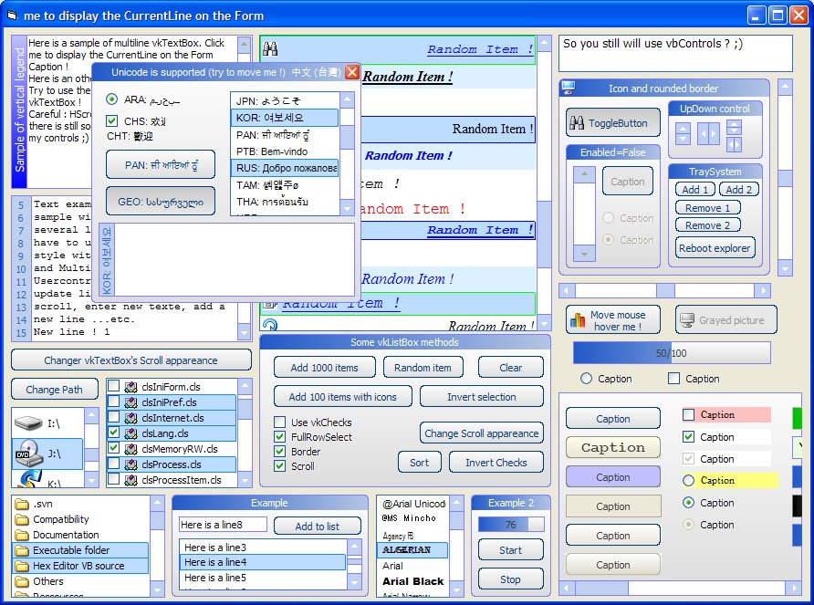



## vkControls : 16 GRAPHICALS usercontrols \! NEVER SEEN before \! \(update 4\)

### Description

Here are 16 VERY customizable graphical usercontrols (XP style by default). NO dependencies needed !! Each usercontrol is self-subclassed using ASM code !! Unicod support. Include vkCommand (the same that the XP one + icon, 6 different styles by default !), vkListBox (it is a very fast (4 seconds to add 100000 items !) "one-column-listview" with checkboxes, icons, different style for EACH item !, FileList, FolderList and DriveList options...), vkVScroll &amp; vkHScroll (very customizable scroll with a high range : +- 4.10^14 !!), vkUpDown, vkToggleButton (vkCommand with the Value property), vkFrame (high customizable Frame with gradients, icon...), vkProgressBar (high number of properties !!), vkCheck (with transparency), vkOption (with transparency and auto-Group option wich automatically manage groups in different containers), vkLabel (border), vkScrollContainer (a vkFrame-like container with scrolls) and vkTextBox (a usercontrol based on a vbTextBox, but with new Scrolls, Legend zone, line numbers, new methods and properties... There are still some bugs concerning TextBox'HScroll). The three last controls are not really graphical usercontrols : vkTimer (new timer with APIs), vkMouseKeyEvents (wich allows to use ALL MISSING EVENTS (MouseLeave, MouseEnter, MiddleClick...) to ALL OF YOUR OWN usercontrols wich have hWnd properties !) and vkSysTray (allows to easily add multiples icons to the SysTray, manage to re-display the icons if explore.exe crashes by hooking 'TaskbarCreated' message !). There are still some little bugs in scrolls of vkListBox and vkTextBox, but sure you will enjoy this code !! Please vote for me ! (and sorry for my english : I'm french ^^).

----

UPDATE 5 JUNE : Now there is a clean package (just launch *.vbg project), high optimisations (when controls are loaded), lots of bugs fixed, new example...etc.

----

UPDATE 11 JUNE : Added two news controls (vkTextBox, vkSysTray), fixed bugs (black controls on W2K), new properties and methods.

----

UPDATE 17 JUNE : Added one new contol (vkScrollContainer), new properties (Pattern for ListBox, 6 default styles for vkCommand and vkToggleButton and some more), fixed some bugs, new example.

----

UPDATE 19 June : Fixed a LOT of bugs + added new properties (MouseHoverIcon...) + added Unicode support + now you can use shortcuts (with '&amp;') + performance optimizations. There are still 2 major bugs : HScroll in vkTextBox and a blank area on the bottom of a vkListBox when VScroll.Value=VScroll.Max. I hope I'll fix it in the next update ;)
 
### More Info
 

             |
---                |---
**Submitted On**   |2007-06-28 19:22:24
**By**             |[violent\_ken](https://github.com/Planet-Source-Code/PSCIndex/blob/master/ByAuthor/violent-ken.md)
**Level**          |Advanced
**User Rating**    |4.9 (324 globes from 66 users)
**Compatibility**  |VB 6\.0
**Category**       |[Custom Controls/ Forms/  Menus](https://github.com/Planet-Source-Code/PSCIndex/blob/master/ByCategory/custom-controls-forms-menus__1-4.md)
**World**          |[Visual Basic](https://github.com/Planet-Source-Code/PSCIndex/blob/master/ByWorld/visual-basic.md)
**Archive File**   |[vkControls2073176292007\.zip](https://github.com/Planet-Source-Code/violent-ken-vkcontrols-16-graphicals-usercontrols-never-seen-before-update-4__1-68734/archive/master.zip)

